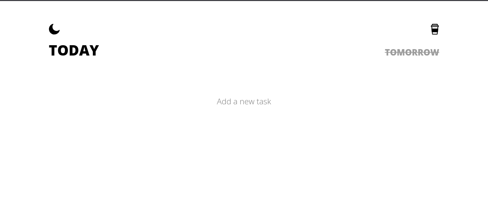
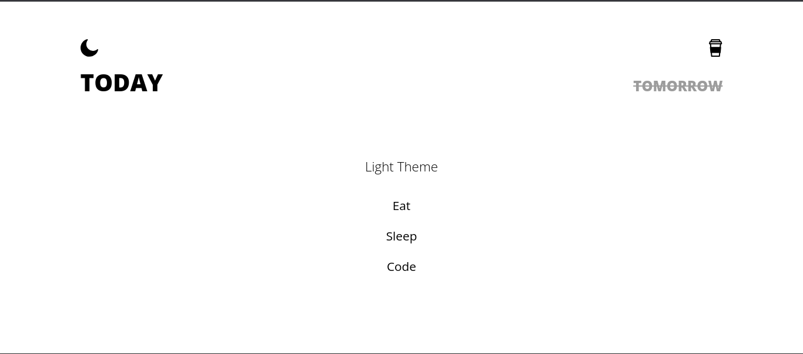

# To-Do App with Node.js, Express, and EJS

Welcome to the Comprehensive To-Do App repository! This project showcases a simple to-do app built using JavaScript, Node.js, Express, and EJS. It combines task management with a dynamic design and the convenience of data persistence.

## Features

- Add, check/uncheck, and delete up tasks
- Light/dark theme toggle
- Data stored in MongoDB with Mongoose
- Dynamic rendering with EJS template engine

## Screenshots

## How to Run Locally

1. Clone the repository: `git clone https://github.com/liaqatXD/To-Do-App-with-Node.js-Express-and-EJS..git`
2. Install dependencies: `npm install`
3. Start the server: `node app.js`
4. Open your web browser and go to `http://localhost:3000`

## Technologies Used

- Node.js
- Express
- EJS (Embedded JavaScript)
- MongoDB with Mongoose

## Acknowledgments

- The design inspiration comes from [Figma Community](https://www.figma.com/community/file/1139629058750631030).
